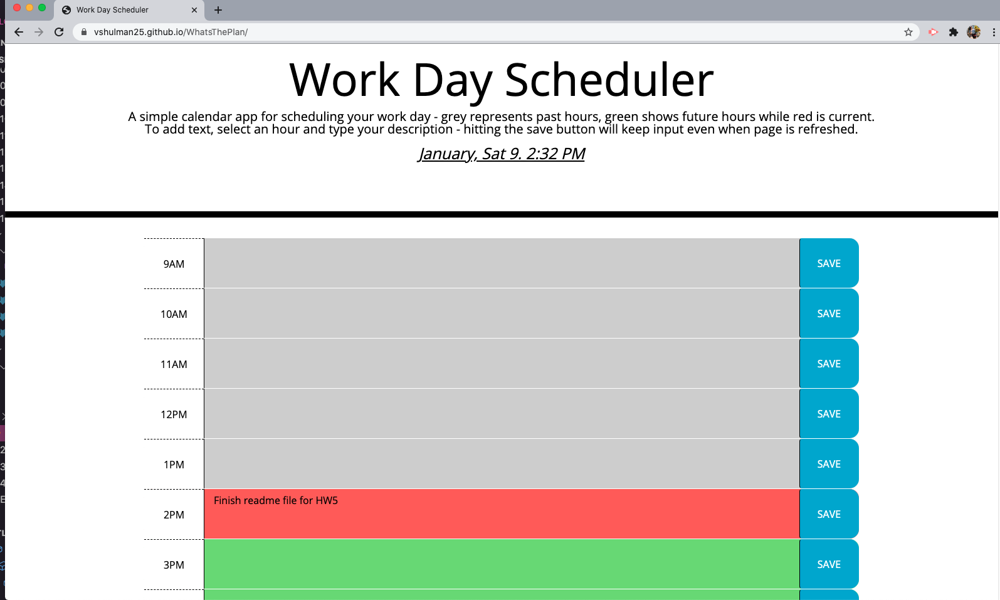

# 05 Third-Party APIs: Work Day Scheduler
---

## Description 

This is a simple day planner that allows users to save events for each business hour of the day (9AM-9PM). This page runs in a browser and is dynamically updated using HTML and CSS, powered with jQuery.

---

## Development Process 

To create this day planner, I built out the provided files to add div containers for each business hour. 

- [ ] HTML provided brings in bootstrap and a CSS file
- [ ] Time blocks need to be added - dayjs
   - [ ] Planner opens to current day
    - [ ] Time blocks are color coded as past, present and future (css)
    - [ ] Add event when clicked - jQuery $(this)
       - [ ] This text is saved in local storage
- [ ] When refreshed, saved events remain on page 
   - [ ] Save input using local store - JSON    

---

## Installation 

Use preferred code reader and browser to view HTML, JS CSS & README files. This app also utilizes dayjs library, accessed as a node module - a gitignore file was created for this to prevent modules from uploading.

--- 

## Preview 

---

## Live Link 

https://vshulman25.github.io/WhatsThePlan/

---

## Credits

Developer - Victoria Shulman 